## 프로젝트 무비팅

<div align="center">


  

</div>

---
### 서비스 목적
- 알고리즘 기반 영화 추천
> - 가입 시 입력 받은 값과 이후 작성한 리뷰값을 토대로 컨텐츠 유사도(similarity)가 높은 영화를 추천한다.
- 알고리즘 기반 유저 추천
> - 유사한 영화 취향을 가진 유저를 마이페이지에 추천해준다.
> - 상호간 친구 추가, 쪽지와 같은 형태로 커뮤니케이션이 가능하도록 한다.

---
## 일정표

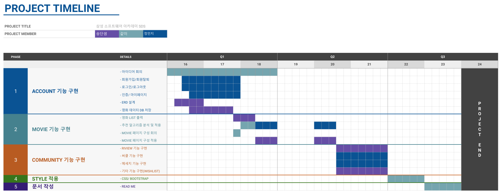

---

## 타임라인

### 11.16 (수)

- kakao 로그인 적용
  - [x] 로그인 적용해서 user 정보들 불러오기까지 진행했음,
  - [x] 회원가입 완성
  - [x] 로그인 시 django 에서 jwt token 발행

---

### 11.16 (목)

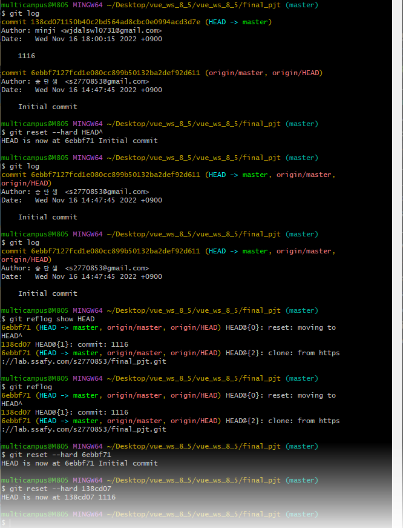

```
<문제>
.gitignore 없이 모든 파일을 업로드 하는 실수 발생.
commit 내용을 되돌리려고 git reset --hard HEAD^ 를 진행하자,
내용이 모두 롤백되어 버렸다.

<해결>
git reflog 로 commit id 확인 후,
git reset --hard <commit_id> 로 다시 복원 완료.
```

- 협업툴 Trello 채택

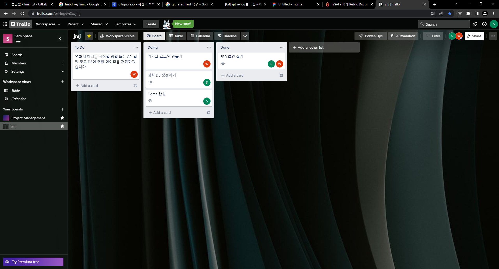

---

### 11.18 (금)

- [x] 카카오 로그아웃 구현 및 영화 추천 알고리즘 찾아보기
- [x] python 이용한 크롤링, 데이터 필터링 후 db 작성 마무리

- [x] ERD 작성

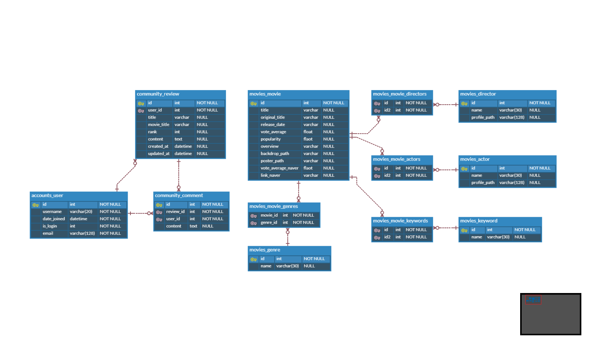

- 계획 변경에 따른 ERD 수정
  
  - [x] 커뮤니티 기능을 위한 테이블 추가

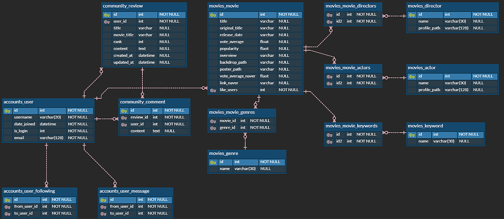

- DB json fixture 파일 생성
  - [x] TMDB 데이터 바탕으로 생성
  - [x] 구글 trans API를 통해 키워드 번역
  - [x] 네이버 API 통한 추가 데이터 수집

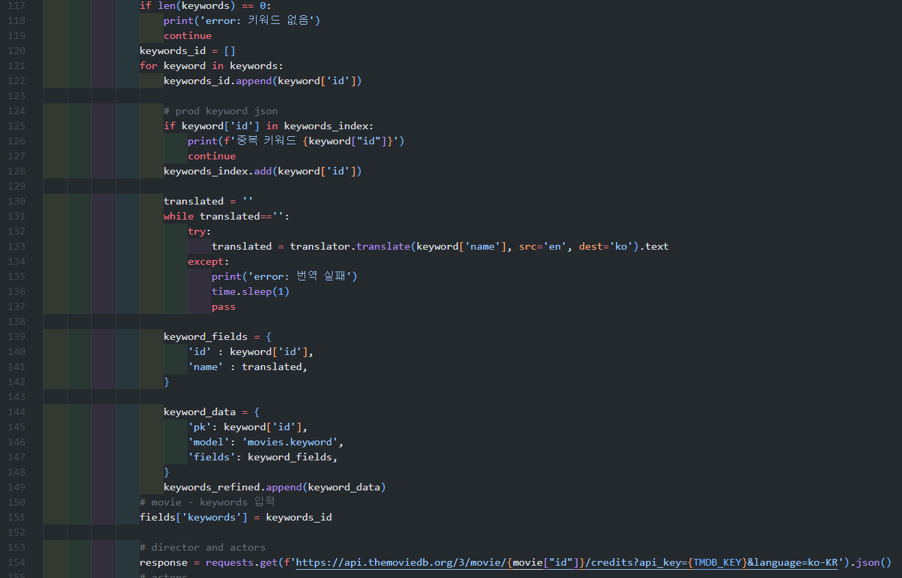
- [x] 초안 레이아웃 작성

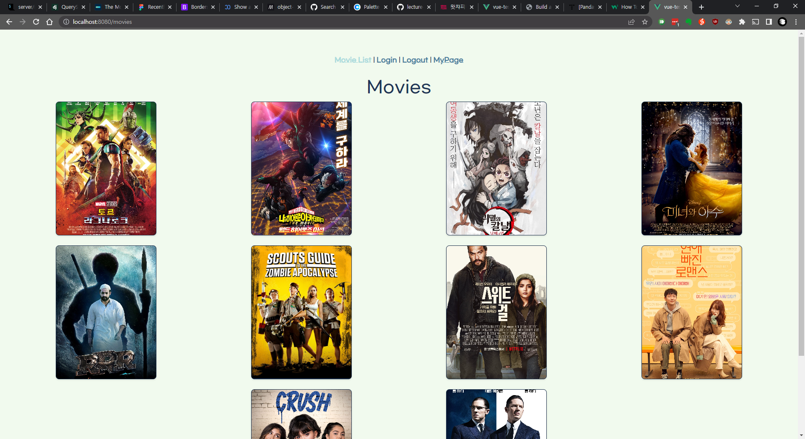
---
### 11.21(월)
- [x] Figma 작성

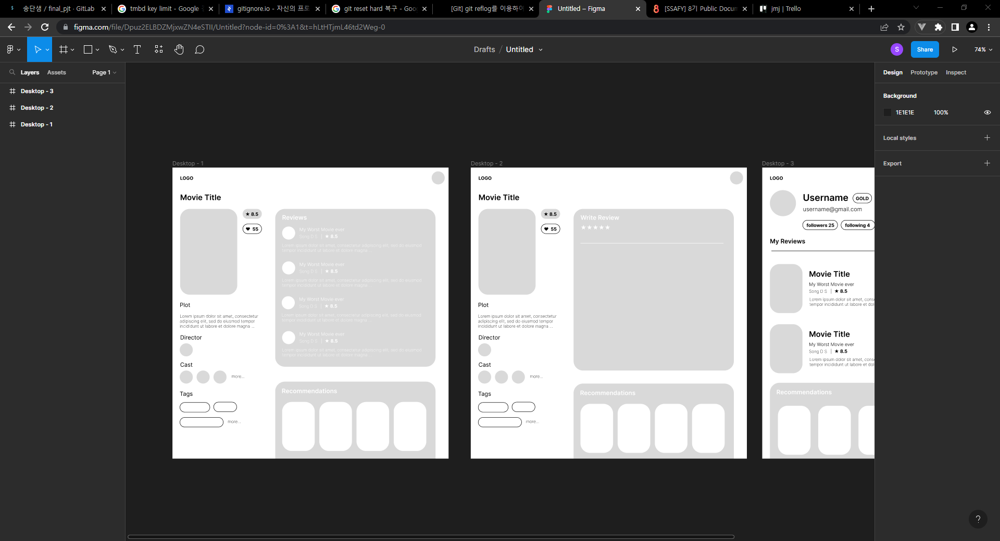

- [x] 전체적인 CSS 레이아웃 작성

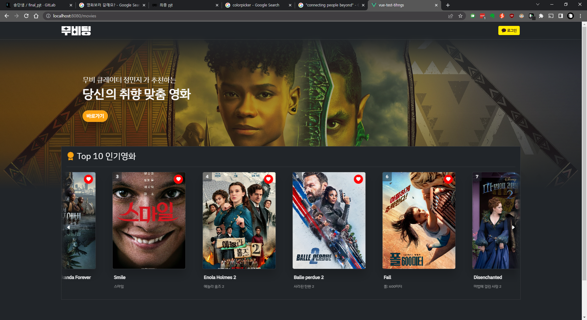
- [x] 키워드 기반 영화 파도타기

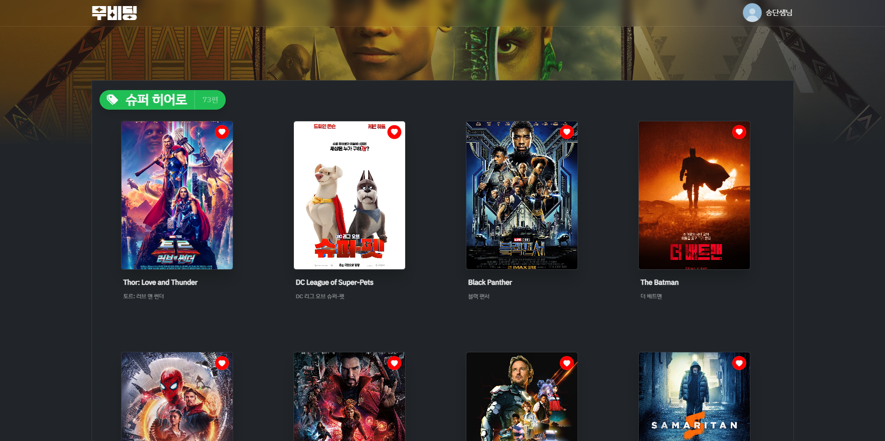
---
### 11.22(화)
- [x] 추천 알고리즘 작성
> 1. movies_json_to_csv 함수에서 fixtures의 json 파일을 원하는 형식의 csv로 변환.
> 2. movies_similarity_genre_set 함수에서 CountVectorizer 의 counter_vector를 사용하여 장르, 키워드간 유사성이 있는 대상을 추출한다.
> 3. c_vector_genres = counter_vector.fit_transform(df['genres'])    c_vector_keywords = counter_vector.fit_transform(df['keywords'])라는 코드로 작성.
> 4. cosine 유사도인cosine_similarity를 사용, 비슷한 장르와 키워드인 영화들을 뽑아와서 병합한다.

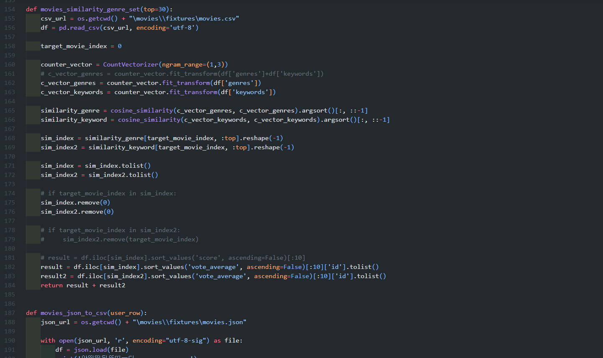
---
### 11.23(수)
- [x] 소설 로그인/로그아웃 완료

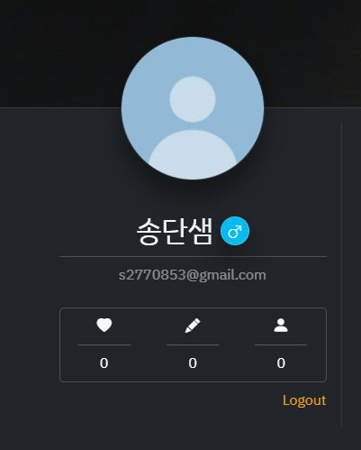

> - js sdk 채용한 로그인.
> - kakao api 를 통해 kakao token으로 kakao 정보를 받는다.
>   - 만약 kakao 로그인을 했는데 해당 정보가 우리 테이블에 없다면 바로 회원가입을 시켜주고 survey 로 redirect.
>   - survey 가 선택되면 그에 맞는 영화를 바로 추천 받을 수 있다
> - 이미 회원 테이블에 있으면 로그인만 가능.
```
<문제>
- 로그아웃 시 카카오 정책 때문에 전체 세션을 삭제할 수가 없다.
- 브라우저에서 카카오 로그인을 한 번 해놓으면 계속 정보가 남아있다.

<해결>
- 로그아웃은 api로 전달해 준다.
- '카카오 계정과 함께 로그아웃'을 통해 세션을 삭제해 줄 수 있다.
```
---
### 11.21(목)
- 신규 회원 설문을 통한 취향 조사 페이지
> - 수집된 데이터와 향후 작성하는 리뷰 점수를 토대로 추천 영화를 결정한다.

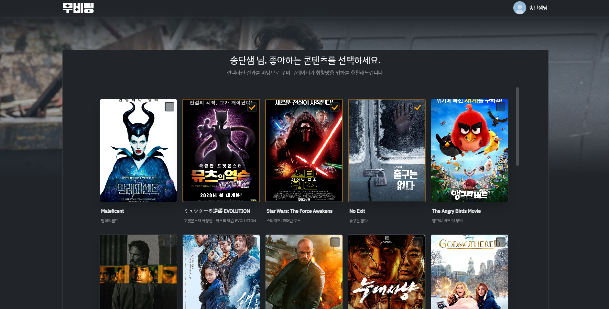
- [x] 취향 맞춤형 추천, 추천 폼 완성
> - 상기된 추천 알고리즘을 토대로 유사한 영화를 추천해준다.
> - 아래 예시는 히어로영화 '블랙아담'과 공포영화 '스마일'을 임의로 선택한 결과.

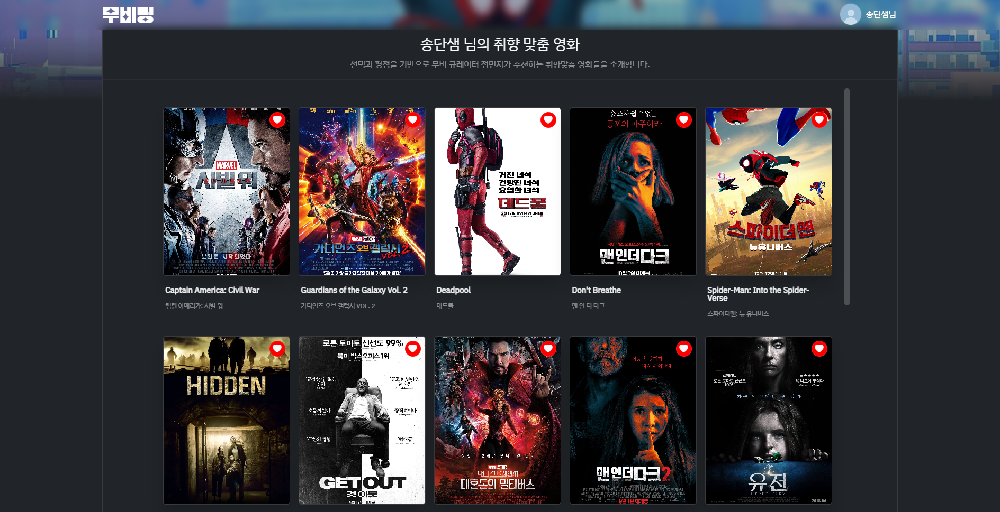

- [x] 같은 취향인 유저 추천
> - 영화 추천과 같은 유사도 알고리즘을 활용한다.

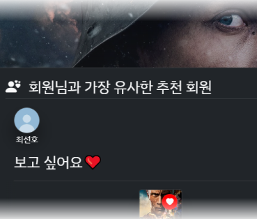

---
### 정리
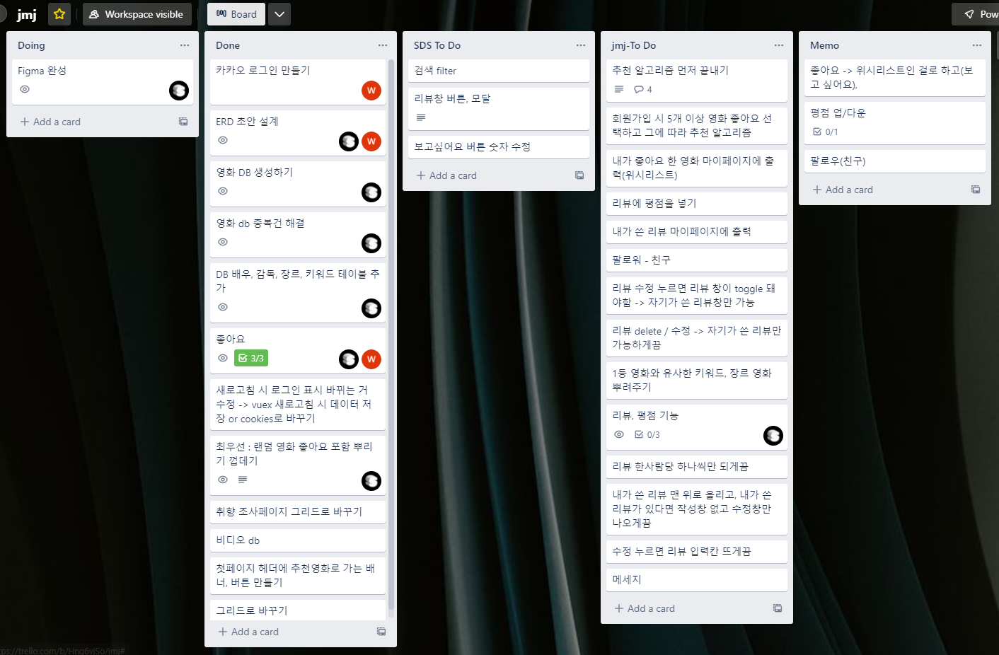
> - 다소 시간이 부족하여 완성된 서비스를 만들진 못했다는 아쉬움은 있지만, 작성 과정에서 git을 통한 branch 사용과 협업에 대해서 보다 숙련된 사용이 가능해졌다. 이해가 따르지 않았던 push/pull 과정은 생각보다 많은 어려움을 낳았다.
> - server/client 사이드를 특별히 구분하여 작업을 나누지 않고 작업하였는데 상호 간 성장을 도모할 수 있었다는 점에서 긍정적으로 작용했다.
> - css 부분은 기존 커리큘럼 상 깊게 다루지 않았는데 프로젝트 작업을 하면서 비약적으로 이해도가 올라갈 수 있었다. 다만 그만큼 투입된 시간이 많아져서 작업이 지체되고 말았다.
> - api를 활용하는 방법에 대한 경험을 쌓을 수 있어 다양한 기능을 접목하는 것의 망설임이 없어졌다. 소셜 로그인을 작성하는 과정에서 많은 애를 먹었는데 문제를 해결하는 과정에서 학습이 수반되었다.

---

<div align="center">


<table>
  <tr>
    <th align="center">송단샘</th>
    <th align="center">정민지</th>
  </tr>
  <tr>
    <td align="center">
      <a href="https://github.com/Song-d-s/">
        
      </a>
      <a href="mailto:s2770853@gmail.com">
        
      </a>
    </td>
    <td align="center">
      <a href="https://github.com/jellyKKing">
        
      </a>
      <a href="mailto:wjdalswl0731@gmail.com">
        
      </a>
    </td>
  </tr>
</table>

</div>